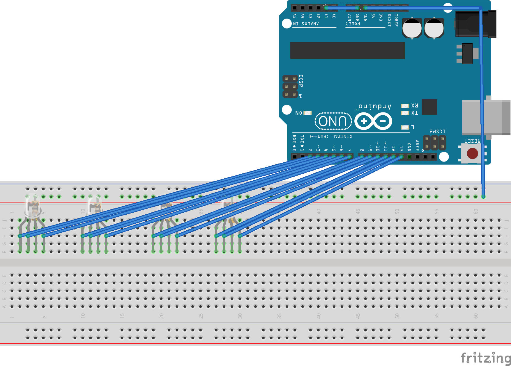

 # Christmas Wraith

I wanted to have a geeky christmas wraith, so I got a number of common cathode rgb LEDs and tried them out.
The code to access the LEDs is in rgbLED.h, so that it can be reused for other projects.

This is the setup diagram (thanks to Fritzing):

### Parts
* 1 x Arduino Uno (or as in my case a Chinese clone)
* 4 x common cathode rgb-LEDs
* 4 x 100 Ohm resistors
* 1 x breadboard
* a lot of cables
